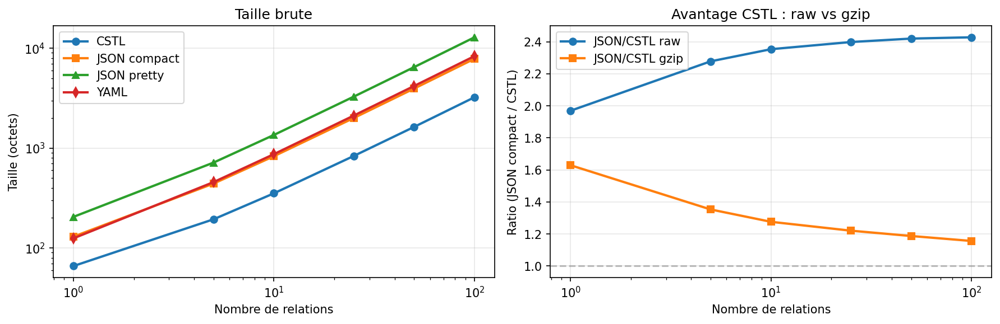

# CSTL v3 — Compressed Semantic Transfer Language

*A relational protocol for lossless AI-to-AI communication.*

[](./LICENSE)


**Author**: Olivier Goyette · **Specification**: v3.0.1 (April 2026)

---

## What is CSTL?

CSTL is a three-layer relational protocol engineered for the problem of *lossless inter-LLM communication* — preserving propositional content, numerical force, temporality, transmission intent, and multi-agent trust state across agent hops.

Unlike RDF (static facts), AMR (single sentences), or JSON-LD (web metadata), CSTL targets discourse-level, weighted, time-stamped, multi-agent payloads with a **uniqueness guarantee by construction** (Theorem 1, validated empirically on 499,689 distinct relations).

## A minimal example

```
# A multi-agent reasoning payload in CSTL v3.0.1
[NET]: project_review_2026
[TRUST][Alice] = 0.95
[TIME]: past

evidence | ARR | fraud_hypothesis  | 0.72 | deep
fraud_hypothesis | [MAY] | audit_required | 0.60 | shallow
board_decision | « | audit_required  | 0.85 | bedrock
Alice | ℙ | recommendation | 0.90 | bedrock
```

In 7 lines: session scope, agent trust, utterance-time anchor, graded confidence, conditional obligation, inter-event ordering, and performative speech act. **Equivalent flat JSON takes ~2.4× more bytes** and cannot express `[TIME]`, `[MAY]`, `«` or `ℙ` without a custom schema.

## Architecture

| Layer | Name | Role | Size |
|---|---|---|---|
| 1 | Semantic | What the relation *means* | 65 symbols |
| 2 | Syntactic | How the relation is *encoded* | 121 tokens |
| 3 | Transport (DNA) | How the relation is *transmitted* | k=9 nucleotides |

- **Theorem 1** (uniqueness): the k=9 encoding is injective by construction for corpora up to 10⁸ relations. Address space: 121⁹ ≈ 5.56 × 10¹⁸.
- **8 foundational axioms** (existence, curvature, transformation, gravity, time, coherence closure, conservation, purge).
- **4-stage pipeline**: `LLM reads → CSTL structures → CSTL verifies → LLM reformulates`.

Full specification: [`CSTL_v3_Spec.docx`](./CSTL_v3_Spec.docx).
Version history: [`CHANGELOG.md`](./CHANGELOG.md).

## Empirical results (April 2026 run)

Four reproducible experiments, all data in this repo:

| Experiment | Result | Source |
|---|---|---|
| **E1 — Compression** | CSTL 2.43× smaller than compact JSON (raw), 1.16× after gzip at N=100 | [`e1_compression.py`](./e1_compression.py) · [`e1_compression.csv`](./e1_compression.csv) |
| **E3 — Expressivity** (v3.0.0) | 0.950 vs flat JSON 0.825 on 20-sentence nuance benchmark | [`e3_expressivity.py`](./e3_expressivity.py) · [`e3_expressivity.csv`](./e3_expressivity.csv) |
| **E3 — Expressivity** (v3.0.1) | **1.000** vs JSON 0.825 after `[TIME]` fix, zero regressions | [`e3_expressivity_v301.csv`](./e3_expressivity_v301.csv) |
| **E4 — Theorem 1 validation** | 0 collisions on 499,689 distinct relations | [`e4_k9_uniqueness.py`](./e4_k9_uniqueness.py) |



*Figure 1 — Left: raw byte counts across protocols and payload sizes. Right: CSTL size advantage over JSON-compact, before and after gzip.*

## Reproducing the results

```bash
# Clone and install dependencies
git clone https://github.com/oliviergoyette30/CSTL.git
cd CSTL
pip install -r requirements.txt

# Deterministic experiments (no API calls, ~30 seconds total)
python3 e1_compression.py
python3 e4_k9_uniqueness.py

# LLM-based experiment (requires ANTHROPIC_API_KEY)
export ANTHROPIC_API_KEY=sk-ant-...
python3 e3_expressivity.py
```

Experimental protocol, exact model versions and dates: [`EXPERIMENTAL_SETUP.md`](./EXPERIMENTAL_SETUP.md).

## What's in this repo

**Specification**
- `CSTL_v3_Spec.docx` — the formal v3.0.1 specification
- `v3.0.1_patch_notes.md` — what changed from v3.0.0
- `CHANGELOG.md` — version history

**Experiments**
- `e1_compression.py`, `e4_k9_uniqueness.py` — deterministic, no API
- `e3_expressivity.py` — LLM-based (requires API key)
- `run_experiments.py` — unified harness for fidelity / compression / fictional-domain experiments
- `*.csv`, `*.png` — raw data and figures from the April 2026 run
- `EXPERIMENTAL_SETUP.md` — hyperparameters, model versions, methodology

**Paper**
- `CSTL_arXiv_draft_v2.md` — pre-empirical draft (v3 with empirical results in preparation)
- `CSTL_Plan_Action.ipynb` — Colab notebook orchestrating the full reproduction pipeline

**Legacy artifacts** (v2 era, still useful as reference)
- `cstl_codec.py`, `cstl_full_test.cpp`, `cstl_colab.py`, `cstl_stsb_test.py`, `korthax_demo.py`
- `A6_limitations.md`, `CSTL_Comparison_Table.pdf`

## FAQ

**How does CSTL differ from RDF, AMR, or JSON-LD?**
RDF encodes static facts, AMR encodes single sentences, JSON-LD annotates web documents. CSTL encodes *multi-agent discourse with pragmatic depth*: numerical forces, temporal scopes, transmission intent, trust relationships — none of which the others capture without custom schemas.

**What's the one-sentence summary?**
*CSTL is JSON for semantics, with provable uniqueness and pragmatic primitives.*

**Is CSTL ready for production use?**
No. This is a research artefact with four empirical results validating core claims. The protocol is stable enough to build on, but a multi-judge evaluation and 100 MB-scale benchmarks are still pending.

**Can I contribute?**
Yes — open an issue or pull request. Please run the deterministic experiments (E1, E4) before submitting code changes to confirm nothing regresses.

## Citation

```bibtex
@misc{goyette2026cstl,
  author = {Goyette, Olivier},
  title  = {CSTL: A Three-Layer Relational Protocol for Lossless AI-to-AI Communication},
  year   = {2026},
  note   = {arXiv preprint (forthcoming)},
  url    = {https://github.com/oliviergoyette30/CSTL}
}
```

## License

MIT — see [`LICENSE`](./LICENSE).
